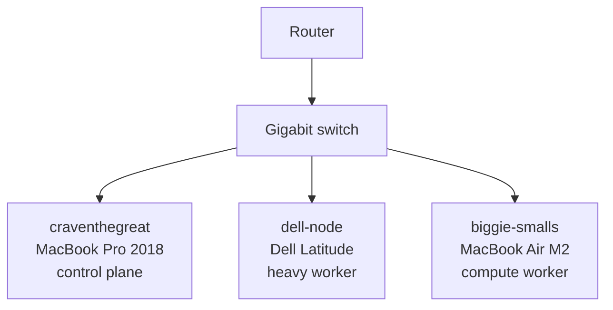
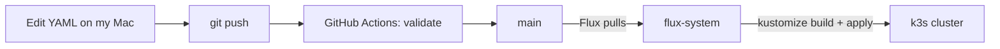

# Laboratório Brasil

[](https://github.com/CravenCraven/homelab/actions/workflows/validate.yaml)


A self-hosted Brazilian Portuguese learning platform running on a three-node k3s cluster at home. Flux watches this repo, so a `git push` is the deploy.

It's also my DevOps portfolio. Everything here is real, runs on hardware I already owned, and has broken at least once.

Live demo: [projectpattie.com/brasil/demo](https://projectpattie.com/brasil/demo/) · Build log: [projectpattie.com](https://projectpattie.com)

---

## Contents

- [Why this exists](#why-this-exists)
- [Platform](#platform)
- [Cluster](#cluster)
- [Stack](#stack)
- [How a change gets deployed](#how-a-change-gets-deployed)
- [Design decisions](#design-decisions)
- [Repo layout](#repo-layout)
- [Getting started](#getting-started)
- [Operations](#operations)
- [Security](#security)
- [Roadmap](#roadmap)
- [Write-ups](#write-ups)

---

## Why this exists

I wanted one place to learn Brazilian Portuguese from beginner to fluent, and a real reason to learn Linux, containers, Kubernetes, GitOps and observability.

The rule: **no new infrastructure unless the app needs it.** Every tool in this repo is here because something in the platform asked for it.

---

## Platform

Nine tiles, same as the [demo page](https://projectpattie.com/brasil/demo/). The full feature plan lives in [docs/roadmap.md](docs/roadmap.md).

| # | Tile | Group | What it does | Built with | Status |
|---|---|---|---|---|---|
| 01 | Tutor | Aprender | Conversation practice against a local 7B model | Open WebUI + Ollama | Running |
| 02 | Coach | Aprender | Writing correction with typed error kinds | Python CLI + Pydantic | Planned |
| 03 | Fichas | Aprender | Flashcard decks from the corpus, with audio | Anki export | Planned |
| 04 | Gíria | Aprender | Carioca slang database, fed by Coach | CloudNativePG | Planned |
| 05 | Música | Mídia | Samba, MPB, choro | Navidrome | Running |
| 06 | Livros | Mídia | Podcasts and audiobooks | Audiobookshelf | Planned |
| 07 | Vídeo | Mídia | Films, with transcript breakdown tooling | Jellyfin | Planned |
| 08 | Grafana | Infra | Node and pod metrics, k3s-adjusted scrape config | kube-prometheus-stack | Planned |
| 09 | Ollama | Infra | CPU inference, 20Gi limit, measured 4.6 tok/s | qwen2.5 7b q4_K_M | Running |

---

## Cluster

Three laptops on a shelf.

| Node | Machine | Role | Arch | OS | Label |
|---|---|---|---|---|---|
| `craventhegreat` | MacBook Pro 2018, 16 GB RAM | Control plane | amd64 | Ubuntu 24.04 | `workload=light` |
| `dell-node` | Dell Latitude, 32 GB RAM, 512 GB | Heavy worker | amd64 | Fedora 43 | `workload=heavy` |
| `biggie-smalls` | MacBook Air M2, 16 GB RAM | Compute worker | arm64 | Fedora Asahi Remix 44 | `workload=compute` |



---

## Stack

### Running today

| Tool | Job |
|---|---|
| k3s | Kubernetes on bare metal, flannel VXLAN networking |
| Flux | GitOps, pulls this repo and applies it |
| Kustomize | Builds the manifests, built into Flux |
| Traefik | Ingress, ships with k3s |
| local-path | Storage, ships with k3s |
| Ollama | Local LLM inference on `dell-node` |
| Open WebUI | Chat front end for Ollama |
| Navidrome | Music server |
| GitHub Actions | Validates YAML on every push |

### Planned

| Tool | Job | Why it's next |
|---|---|---|
| Sealed Secrets | Encrypted secrets committed to Git | Needed before any app gets a password |
| kube-prometheus-stack | Prometheus, Grafana, node-exporter | Tile 08, and I want to see the Dell under load |
| CloudNativePG | Postgres operator with backups | fsi-scraper and Gíria need a database |
| Terraform + AKS | Same platform in Azure | Prove it runs in the cloud, then tear it down |

### Built here

| Project | What it is | Status |
|---|---|---|
| `fsi-scraper` | Corpus pipeline, 26 stages, ruff + pytest | Building |
| `coach` | Python CLI, typed corrections via Pydantic | Planned |
| Portal | The demo dashboard, served from a ConfigMap | Static demo |

---

## How a change gets deployed



Nobody runs `kubectl apply` by hand. If it isn't in `main`, it isn't in the cluster.

This Flux instance also watches a second repo, [`homelab-kubecraft`](https://github.com/CravenCraven/homelab-kubecraft), through `clusters/staging/kubecraft.yaml`. Course work and Brasil share the cluster but not the repo.

---

## Design decisions

| Decision | Why | Trade-off |
|---|---|---|
| **Flux, not Argo CD** | Pull-based, no UI to secure, and it's what the KubeCraft course teaches | No built-in web dashboard |
| **k3s, not full Kubernetes** | One binary, runs on laptops, ships with Traefik and local-path | Fewer knobs than kubeadm |
| **local-path storage for now** | Zero setup, fast on local disks | Volumes are tied to one node and can't be resized. Shared storage is on the roadmap |
| **Ollama on `dell-node`** | It has the RAM. A 7B model needs about 20 GiB with headroom | CPU only, 4.6 tokens per second |
| **Node labels, not node names** | `workload=heavy` survives a rebuild, a hostname might not | One more thing to set when joining a node |
| **`strategy: Recreate` for Ollama** | Two copies of a 20 GiB model can't fit at once during a rolling update | A few seconds of downtime on each update |
| **Monorepo layout (in progress)** | `base` plus overlays means staging and production share one definition | Bigger move up front |
| **Separate repo for course work** | Keeps Brasil history clean | Two Flux sources to watch |

---

## Repo layout

### Today

```
.github/workflows/validate.yaml   # CI: lint and build the manifests
clusters/
└── staging/
    ├── flux-system/              # Flux itself, generated by flux bootstrap
    ├── brasil/                   # every Brasil app, one file each
    │   ├── namespace.yaml
    │   ├── ingress.yaml
    │   ├── navidrome.yaml
    │   ├── ollama.yaml
    │   ├── open-webui.yaml
    │   └── kustomization.yaml
    └── kubecraft.yaml            # points Flux at the kubecraft repo
docs/
└── roadmap.md                    # full feature plan
```

### Target

```
apps/
├── base/             # navidrome, ollama, open-webui
├── staging/
└── production/
infrastructure/
├── base/             # ingress, monitoring, cnpg, sealed-secrets
├── staging/
└── production/
clusters/
├── staging/          # Flux Kustomizations
└── production/
```

Apps move one at a time so Flux never sees a missing file and deletes something that was running.

---

## Getting started

### Prerequisites

- SSH access to the nodes (`ssh dell`, `ssh biggie`)
- `kubectl` with a kubeconfig for the cluster
- [`flux` CLI](https://fluxcd.io/flux/installation/)
- `git` and a GitHub token with repo access (for bootstrap only)

### Check the cluster

```bash
kubectl get nodes -o wide
flux get sources git -A
flux get kustomizations -A
kubectl get pods -n brasil -o wide
```

### Deploy a change

```bash
git add <file>
git commit -m "feat(brasil): <what changed>"
git push origin main
flux reconcile kustomization flux-system --with-source   # optional, skips the wait
```

### Rebuild from zero

1. Install k3s on the control plane, then join the workers.
2. Label the nodes:
```bash
   kubectl label node craventhegreat workload=light
   kubectl label node dell-node workload=heavy
   kubectl label node biggie-smalls workload=compute
```
3. Bootstrap Flux:
```bash
   flux bootstrap github \
     --owner=CravenCraven \
     --repository=homelab \
     --branch=main \
     --path=clusters/staging \
     --personal
```

---

## Operations

### If a node goes down

| Node | What stops | What to do |
|---|---|---|
| `craventhegreat` | The API. Running pods keep going, but nothing new gets scheduled | Bring it back. It's the only control plane |
| `dell-node` | Ollama, Open WebUI, Navidrome | Their volumes live on this disk, so they wait for it. Nothing moves elsewhere |
| `biggie-smalls` | Only pods labeled `workload=compute` | Low impact today |

### Backups

**Current state: none.** Volumes live only on `dell-node`'s disk.

Planned: CloudNativePG backups with a tested restore, and a 2 TB external drive on `dell-node` for media and volume copies.

### Known issues

| Issue | Impact | Fix |
|---|---|---|
| Navidrome env vars renamed upstream: `ND_SCANSCHEDULE` should be `ND_SCANNER_SCHEDULE`, and `ND_ENABLESTARTUPSCAN` should be `ND_SCANNER_SCANONSTARTUP` | Periodic scanning silently off | Rename in `navidrome.yaml` |
| Music library not copied to `dell-node` yet | Música tile is empty | rsync from the Mac |
| Single control plane | No HA | Accepted for a homelab |

---

## Security

| Area | Today | Planned |
|---|---|---|
| Secrets | None committed to this repo | Sealed Secrets, so encrypted secrets can live in Git |
| Exposure | Nothing is on the public internet yet. Apps are reached on the home network or with `kubectl port-forward` | Tiles go public through Cloudflare Tunnel, no router ports opened, each behind a login. Ollama's API is never exposed directly |
| Cluster access | kubeconfig on my Mac, SSH keys to each node | |
| Git access | Flux reads the repo over HTTPS | Deploy key |
| Workloads | Pinned image tags | Non-root, read-only filesystems, dropped capabilities, resource limits on every app |
| Login | Each app has its own | Authentik SSO (v2) |

---

## Roadmap

Full list with every planned module: [docs/roadmap.md](docs/roadmap.md).

**Now**
- [ ] Fix the Navidrome env vars and load the music library
- [ ] fsi-scraper into CloudNativePG
- [ ] Move to the monorepo layout

**Next**
- [ ] Sealed Secrets
- [ ] kube-prometheus-stack (tile 08)
- [ ] Harden every app: non-root, limits, probes
- [ ] Flux image automation
- [ ] Traefik hostnames, then Cloudflare Tunnel to make the tiles public

**Later**
- [ ] Terraform + AKS: portal to the cloud, then torn down
- [ ] CloudNativePG backups with a tested restore
- [ ] Shared storage
- [ ] Tailscale
- [ ] Coach, Fichas, Gíria, Livros and Vídeo tiles
- [ ] Self-hosted Git with Forgejo
- [ ] Second cluster on Talos and Cilium (separate from this one)

**v2**
- [ ] Authentik SSO
- [ ] Search

---

## Write-ups

Posts about building this cluster, on [projectpattie.com](https://projectpattie.com):

- [Joining the Dell as a k3s worker node](https://projectpattie.com/blog/joining-the-dell-as-a-k3s-worker-node/)
- [Setting Up GitOps with Flux](https://projectpattie.com/blog/setting-up-gitops-with-flux/)
- [Why Won't My LoadBalancer Load Balance Anything?](https://projectpattie.com/blog/why-wont-my-loadbalancer-load-balance/)
- [Where Does the Grafana Password Actually Come From?](https://projectpattie.com/blog/where-does-the-grafana-password-come-from/)

Coming soon: *Joining a Fedora Laptop to k3s as a Worker Node* and *Moving Ollama to a Worker Node with Flux*.
